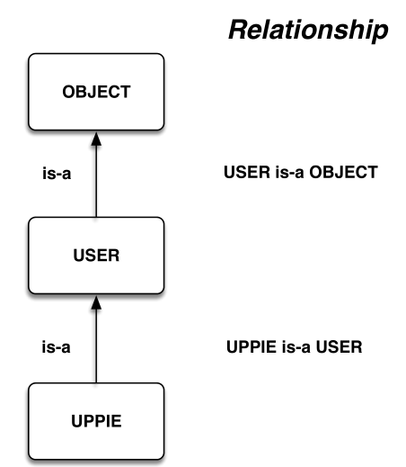
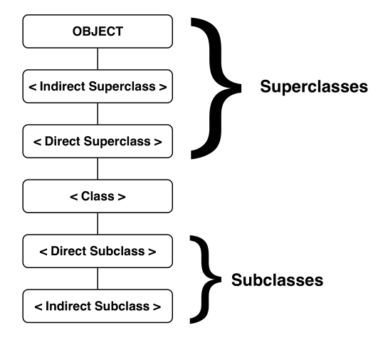
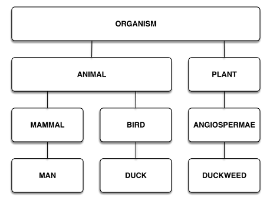
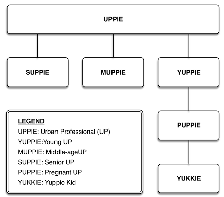
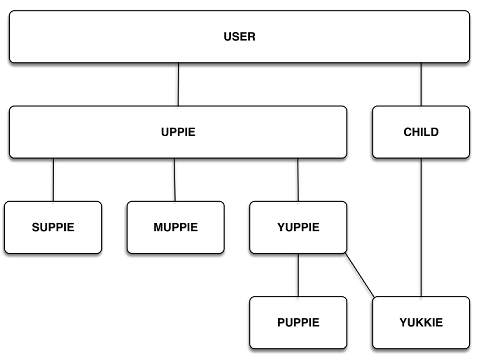
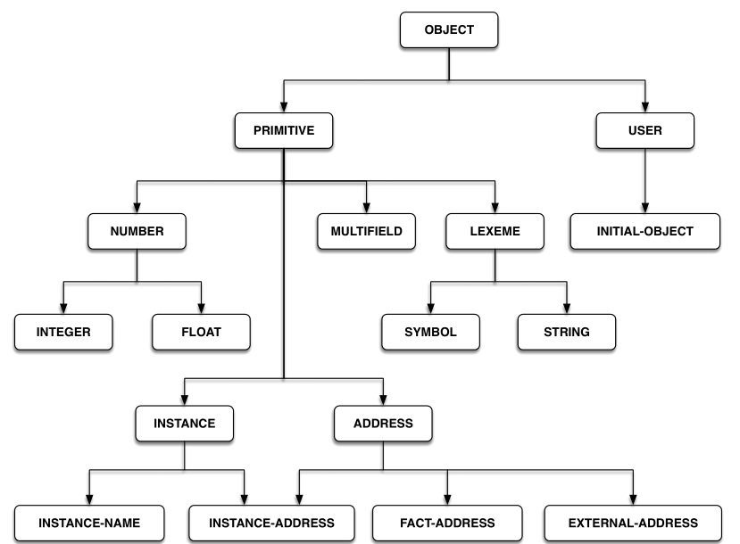
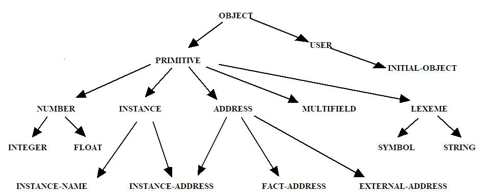
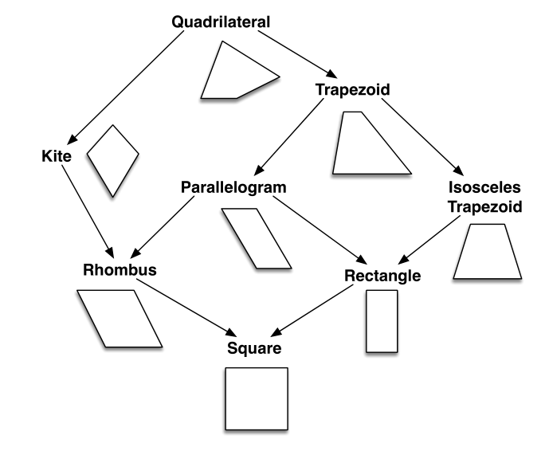

## CLIPS 6.4 Guía del usuario (2021)

>  Autor: Dr. Joseph C. Giarratano<br>
>  Editor: Gary Riley


# Capítulo 8: Cuestiones de herencia


> La forma más fácil de obtener riqueza es heredándola; la segunda mejor forma es hacerlo con el trabajo de otros; casarse con la riqueza se parece demasiado al trabajo.

Este capítulo es una descripción general de la programación orientada a objetos en CLIPS (COOL)[^cool]. A diferencia de la programación basada en reglas, en la que puede saltar directamente y escribir una regla sin importar qué más haya en el sistema, la programación orientada a objetos requiere algunos preparativos previos que son esenciales.


<small> _N. del T._: Estos contenidos pertenecen aún, a la versión CLIPS 6.31. Serán revisados y actualizados antes de septiembre de 2022. </small>


## 8.1. Cómo ser objetivo


Una característica clave del buen diseño del programa es la flexibilidad. Desafortunadamente, la metodología rígida de las técnicas de programación estructurada no brinda la flexibilidad necesaria para cambios rápidos, confiables y eficientes. El paradigma de la programación orientada a objetos (POO) sí proporciona esta flexibilidad.


El término paradigma proviene de la palabra griega paradeigma que significa modelo, ejemplo o patrón. En informática, un paradigma es una metodología consistente y organizada para tratar de resolver un problema. Hoy en día, existen muchos paradigmas de programación como la OOP, procedimental, basado en reglas y conexionista. El término sistemas neuronales artificiales es un sinónimo moderno del término más antiguo conexionista.


La programación tradicional es procedimental porque enfatiza algoritmos o procedimientos para resolver problemas. Se han desarrollado muchos lenguajes para admitir este paradigma de procedimiento, como Pascal, C, Ada, FORTRAN y BASIC. Estos lenguajes también se han adaptado para el diseño orientado a objetos (OOD) agregando extensiones o imponiendo una metodología de diseño a los programadores. Por el contrario, se han desarrollado nuevos lenguajes para proporcionar OOP, que no es lo mismo que OOD. Puede hacer OOD en cualquier idioma, incluso en lenguaje ensamblador.


CLIPS proporciona tres paradigmas: reglas, objetos y procedimientos. Aprenderá más sobre los objetos en CLIPS Object Oriented Language (COOL)[^cool], que está integrado con los paradigmas basados ​​en reglas y procedimientos de CLIPS. CLIPS admite el paradigma de procedimiento a través de funciones genéricas, funciones predeterminadas y funciones externas definidas por el usuario. Según la aplicación, puede utilizar reglas, objetos, procedimientos o una combinación.

En lugar de imponer un solo paradigma al usuario, nuestra filosofía es que una variedad de herramientas especializadas, un enfoque multiparadigma, es mejor que tratar de obligar a todos a usar una sola herramienta de propósito general. Como analogía, si bien podría usar un martillo y clavos para sujetar todo, hay casos en los que se prefieren otros sujetadores. Por ejemplo, imagina sujetar tus pantalones con un martillo y clavos en lugar de una cremallera. (NOTA: si alguien usa un martillo y clavos en sus pantalones, comuníquese con el Libro Guiness de los Récords Mundiales).


## 8.2. La clase 'cosas'


En OOP, una clase es una plantilla que describe las características o atributos comunes de los objetos. Tenga en cuenta que este uso del término plantilla no es lo mismo que una deftemplate como se describe en un capítulo anterior. Aquí, la palabra plantilla se usa en el sentido de una herramienta que se usa para construir objetos que tienen atributos comunes. Como analogías, una regla es una plantilla para dibujar líneas rectas, mientras que un cortador de galletas es una plantilla curvilínea.

Las clases de objetos se organizan en una jerarquía o en un gráfico para describir las relaciones de los objetos en un sistema. Cada clase es una abstracción de un sistema del mundo real o algún otro sistema lógico que estamos tratando de modelar. Por ejemplo, un modelo abstracto de un sistema del mundo real podría ser un automóvil. Otro modelo abstracto de un sistema lógico podrían ser instrumentos financieros como acciones y bonos, o números complejos. El término abstracción se refiere a (1) la descripción abstracta de un objeto del mundo real u otro sistema que estamos tratando de modelar, o (2) el proceso de representar un sistema en términos de clases. La abstracción es una de las cinco características generalmente aceptadas de un verdadero lenguaje OOP. Los otros son herencia, encapsulación, polimorfismo y enlace dinámico. Estos términos se explicarán en detalle a medida que lea este libro. CLIPS es compatible con estas cinco características.

El término abstracto significa que no nos preocupan los detalles no esenciales. Una descripción abstracta de un sistema complejo es una descripción simplificada que se concentra en información relevante para un propósito específico. Así, el sistema está representado por un modelo más simple y fácil de entender. Como ejemplo familiar, cuando ciertas personas conducen automóviles, utilizan un modelo abstracto de conducción que consta de dos elementos: el volante y el acelerador. Es decir, a estas personas no les interesan los cientos de componentes que componen un automóvil, ni la teoría de los motores de combustión interna, las leyes de tránsito, etc. Saber sólo cómo usar el volante y el acelerador es su modelo abstracto de conducción.

Una de las cinco características fundamentales de la programación orientada a objetos es la herencia. Las clases se organizan en una jerarquía con las clases más generales en la parte superior y las clases más especializadas en la parte inferior. Esto permite que las nuevas clases se definan fácilmente como refinamientos especializados o modificaciones de las clases existentes.

El uso de la herencia puede acelerar en gran medida el desarrollo de software y aumentar la confiabilidad porque no es necesario crear un nuevo software desde cero cada vez que se crea un nuevo programa. OOP facilita el uso de código reutilizable. Los programadores de programación orientada a objetos suelen utilizar bibliotecas de objetos que constan de cientos o miles de objetos. Estos objetos se pueden usar o modificar según se desee en un nuevo programa. Además de las bibliotecas de objetos de dominio público, varias empresas comercializan bibliotecas de objetos comerciales. Aunque el concepto de componentes de software reutilizables ha existido desde los primeros días de las bibliotecas de subrutinas de FORTRAN en la década de 1960, nunca antes se había utilizado con tanto éxito para el desarrollo de software general.

Para definir una clase, debe especificar una o más clases principales o superclases de la clase que se va a definir. Como analogía con las superclases, toda persona tiene padres; las personas no surgen espontáneamente (aunque a veces puede preguntarse si ciertas personas realmente tuvieron padres). Lo opuesto a una superclase es una clase o subclase hija.

Esto determina la herencia de la nueva clase. Una subclase hereda atributos de una o más superclases. El término atributo en COOL se refiere a las propiedades de un objeto, que se denominan `slots` o campos que lo describen. Por ejemplo, un objeto para representar a una persona puede tener campos para el nombre, la edad, la dirección, etc.

Una instancia, es un objeto que tiene valores concretos asignados a sus campos, como John Smith, 28, 1000 Main St., Clear Lake City, TX. Las clases de nivel inferior heredan automáticamente sus campos de las clases de nivel superior, a menos que los campos estén bloqueados explícitamente. Se definen nuevos campos además de los campos heredados para establecer todos los atributos que describen la clase.


El comportamiento de un objeto está definido por sus controladores de mensajes, o controladores para abreviar. Un controlador de mensajes para un objeto responde a los mensajes y realiza las acciones requeridas. Por ejemplo, enviar el mensaje

```racket
(send [John_Smith] print)
```


Esto, haría que el controlador de mensajes apropiado imprimiese los valores de los campos de la instancia John_Smith. Las instancias generalmente se especifican entre corchetes, [ ]. Un mensaje comienza con la función de envío, seguida del nombre de la instancia, el nombre del mensaje y los argumentos necesarios. Por ejemplo, en el caso del mensaje de impresión, no hay argumentos. Un objeto en CLIPS es una instancia de una clase.


La encapsulación de campos y controladores dentro de un objeto es otra de las cinco características generalmente aceptadas de un OOP. El término encapsulado significa que una clase se define en términos de sus campos y controladores. Aunque un objeto de una clase puede heredar campos y controladores de


En sus superclases, con algunas excepciones que se analizan más adelante, los valores de campos del objeto no se pueden modificar ni examinar sin enviar un mensaje al objeto.


La clase raíz o simplemente raíz de CLIPS es una clase de sistema predefinida llamada OBJETO. La clase de sistema predefinida USER es una subclase de OBJECT.


## 8.3. Cómo obtienen los YUPPIES lo suyo


Como ejemplo, supongamos que quisiéramos definir una clase llamada UPPIE, que es un término coloquial para profesional urbano. Tenga en cuenta que en este libro seguiremos la convención de escribir las clases en mayúsculas.


La Fig. 8.1 ilustra cómo los YUPPIS (UPPIE) obtienen su herencia hasta el OBJETO de la clase raíz. Tenga en cuenta que UPPIE se define como una subclase de USER. Los cuadros o nodos representan clases, mientras que las flechas de conexión se denominan enlaces. A menudo se utilizan líneas en lugar de flechas para simplificar el dibujo. Además, dado que CLIPS solo admite enlaces is-a, la relación "is-a" no se escribirá explícitamente junto a cada enlace a partir de ahora.



**Figura 8.1. La clase UPPIE**


La convención que seguiremos para la relación entre clases es que el final de la flecha está en la subclase mientras que la cabeza apunta a la superclase. Las relaciones de la figura 8.1 siguen esta convención. Otra convención posible es usar flechas para señalar las subclases.

El enlace is-a indica la herencia de campos de una clase a su subclase. Una clase puede tener cero o más subclases. Todas las clases excepto OBJECT deben tener una superclase. Dado que UPPIE también hereda todos los campos de USER y USER hereda todos los campos de OBJECT, se deduce que UPPIE también hereda todos los campos de OBJECT. El mismo principio de herencia también se aplica a los manejadores de mensajes de cada clase. Por ejemplo, UPPIE hereda todos los controladores de USER y OBJECT.

La herencia de campos y controladores es particularmente importante en OOP ya que significa que no tiene que redefinir las propiedades y el comportamiento de cada nueva clase de objetos que se define. En cambio, cada nueva clase hereda todas las propiedades y el comportamiento de sus clases de nivel superior. Dado que el nuevo comportamiento se hereda, puede reducir sustancialmente la verificación y validación (V&V) de los controladores. V&V esencialmente significa que el producto se construyó correctamente y que cumple con los requisitos. La tarea de verificar y validar el software puede requerir más tiempo y dinero que el propio desarrollo del software, especialmente si el software afecta la vida humana y la propiedad. La herencia de controladores permite la reutilización eficiente del código existente y acelera el desarrollo.

Las clases se definen en CLIPS utilizando la construcción defclass. La clase UPPIE se define en una declaración de la siguiente manera.


```lips
(defclass UPPIE (is-a USER))
```

Observe la similitud entre la relación UPPIE-USUARIO de la figura 8.1 y la construcción (defclass).
No es necesario ingresar las clases USUARIO u OBJETO, ya que estas son clases predefinidas y, por lo tanto, CLIPS ya conoce su relación. De hecho, si intenta definir USUARIO u OBJETO, aparecerá un mensaje de error ya que no puede cambiar las clases predefinidas, a menos que cambie el código fuente de CLIPS.


Dado que CLIPS distingue entre mayúsculas y minúsculas, los comandos y funciones deben ingresarse en minúsculas. Las clases de sistema predefinidas, como USUARIO y OBJETO, deben ingresarse en mayúsculas. Si bien puede ingresar clases definidas por el usuario en minúsculas o mayúsculas, seguiremos la convención de usar todas las mayúsculas para las clases por motivos de legibilidad.


El formato básico del comando defclass para definir solo clases, y no campos, es,

```lips
(defclass <class> (is-a <direct-superclasses>))
```


La lista de clases, <direct-superclasses>, se denomina lista de precedencia de superclase directa porque define cómo se vincula una clase con sus superclases directas. Las superclases directas de una clase son una o más clases nombradas después de una palabra clave. En nuestro ejemplo, la clase PATO es la superclase directa de PATO. Tenga en cuenta que debe proporcionarse al menos una superclase directa en la lista de precedencia de superclases directas.

Si la lista directa de superclases fuera la siguiente,


```lips
(defclass DUCK (is-a DUCKLING USER OBJECT))
```


Entonces USER y OBJECT también serían superclases directas de DUCK. En este ejemplo, no importa si se especifican USER y OBJECT además de DUCKLING. De hecho, dado que USER y OBJECT son clases predefinidas que siempre están vinculadas, de modo que USER is-a OBJECT y OBJECT es la raíz, nunca es necesario especificarlas excepto cuando se define una subclase de USER. Dado que USER sólo hereda de OBJECT, no es necesario especificar OBJECT si se especifica USER.


Las superclases indirectas de una clase son todas las clases que no tienen el nombre de "is-a" que aportan campos (atributos) y manejadores de mensajes por herencia. En nuestro ejemplo, las superclases indirectas son USER y OBJECT. Una clase hereda campos y manejadores de mensajes de todas sus superclases directas e indirectas. Por lo tanto, DUCK hereda de DUCKLING, USER y OBJECT.


Una subclase directa está conectada por un solo enlace a la clase por encima de ella. Una subclase indirecta tiene más de un enlace. La figura 8.2 resume la terminología de la clase.




**Figura 8.2. Relaciones inter-clases**


La clase raíz OBJECT es la única clase que no tiene una superclase.
El uso de esta nueva y elegante terminología nos permite enunciar la

> Principio de Herencia OOP

> **Una clase puede heredar de todas sus superclases.**


Este es un concepto simple pero poderoso que se explota completamente en OOP. Este principio significa que los campos y los manejadores de mensajes se pueden heredar para ahorrarnos el problema de redefinirlos para nuevas subclases. Además, los espacios se pueden personalizar fácilmente para nuevas subclases como modificaciones y como compuestos de espacios de superclase. Al permitir la reutilización fácil y flexible del código existente, se reducen el tiempo y el costo de desarrollo del programa. Además, la reutilización del código de trabajo existente minimiza la cantidad de verificación y validación necesaria. Todas estas ventajas facilitan las tareas de mantenimiento del programa de depuración, modificación y mejora una vez liberado el código.


La razón para usar "puede-heredar" en el principio es enfatizar que la herencia de campos de una clase puede bloquearse al incluir una propiedad de no herencia en la definición de ese campo de clase.


Las clases directas e indirectas de una clase son todas aquellas que se encuentran en un camino de herencia a OBJECT. Una ruta de herencia es un conjunto de nodos conectados entre la clase y el OBJETO. En nuestro ejemplo, la ruta de herencia única de DUCK es DUCK, DUCKLING, USER y OBJECT. Verá ejemplos más adelante, como la figura 8.6, en los que una clase tiene múltiples rutas de herencia a OBJECT.


La Fig. 8.3 ilustra una taxonomía muy simplificada de organismos que ilustra la herencia en la Naturaleza. El término taxonomía significa una clasificación. Las taxonomías biológicas están diseñadas para mostrar el parentesco de los organismos. Es decir, una taxonomía biológica enfatiza las similitudes entre los organismos agrupándolos.




**Figura 8.3. Taxonomía simple de organismos vivos con enlaces is-a**


In a taxonomy like Fig. 8.3, the connecting lines are all is-a links. For example, a DUCK is-a BIRD. A BIRD is-a ANIMAL. An ANIMAL "is-a" ORGANISM and so forth. Although the genetic inheritance of each individual is different, the characteristics of MAN and DUCK are the same for each species.


In Fig. 8.3, notice that the most general class, ORGANISM, is at the top, while more specialized classes are lower in the taxonomy. In CLIPS terminology, we would say that each subclass inherits the slots of its parent classes. For example, since mammals are warm-blooded and give birth to live young, with the exception of the platypus, the class MAN inherits the attributes of the parent MAMMAL class. The direct superclass of MAMMAL is ANIMAL and the direct subclass of MAMMAL is MAN. The indirect superclass of MAMMAL is ORGANISM.


The other classes such as BIRD, DUCK, and so forth have no relationship to MAMMAL because they are not on an inheritance path from the most general class ORGANISM. An inheritance path is any path from one class to another that does not involve backtracking or retracing the path. A class such as PLANT is not on an inheritance path to MAMMAL because we would have to backtrack to ORGANISM before continuing down to MAMMAL. Thus, MAMMAL does not automatically obtain any slots from PLANT or any other classes not on the inheritance path to MAMMAL. This model of inheritance mirrors the real world, since otherwise we might have grass growing on our heads instead of hair.


En una taxonomía como la de la figura 8.3, las líneas de conexión son todas enlaces "es-un". Por ejemplo, un PATO es un PÁJARO. UN PÁJARO es un ANIMAL. Un ANIMAL "es-un" ORGANISMO y así sucesivamente. Aunque la herencia genética de cada individuo es diferente, las características de HOMBRE y PATO son las mismas para cada especie.


En la figura 8.3, observe que la clase más general, ORGANISMO, está en la parte superior, mientras que las clases más especializadas están más abajo en la taxonomía. En la terminología de CLIPS, diríamos que cada subclase hereda los campos de sus clases principales. Por ejemplo, dado que los mamíferos son de sangre caliente y dan a luz crías vivas, con la excepción del ornitorrinco, la clase HOMBRE hereda los atributos de la clase madre MAMÁL (MAMÍFEROS). La superclase directa de MAMMAL es ANIMAL y la subclase directa de MAMMAL es MAN. La superclase indirecta de MAMMAL es ORGANISMO.


Las otras clases como BIRD, DUCK, etc. no tienen relación con MAMMAL porque no están en un camino de herencia de la clase más general ORGANISM. Una ruta de herencia es cualquier ruta de una clase a otra que no implique retroceder o volver sobre la ruta. Una clase como PLANTA no está en un camino de herencia a MAMMAL porque tendríamos que retroceder hasta ORGANISMO antes de continuar hasta MAMMAL. Por lo tanto, MAMMAL no obtiene automáticamente ningún campo (atributo) de PLANT ni de ninguna otra clase que no esté en el camino de herencia a MAMMAL. Este modelo de herencia refleja el mundo real, ya que, de lo contrario, podríamos tener hierba en la cabeza en lugar de cabello.


## 8.4. El clase YUKKIE ilegítima

Ahora que tiene la idea básica de las clases, agreguemos algunas clases adicionales al diagrama UPPIE de la figura 8.1 para que el ejemplo sea más realista. Este tipo de desarrollo mediante la adición de clases de nivel inferior es la forma en que se hace OOP, agregando clases desde las clases más generales hasta las clases más específicas.

La Fig. 8.5 muestra el diagrama de herencia del YUKKIE ilegítimo. Para simplificar, no se muestran las clases OBJECT y USER. La jerarquía de la figura 8.5 es un árbol porque cada nodo tiene exactamente un padre.




**Figura 8.5. El YUKKIE ilegítimo**

---


Un ejemplo familiar de una estructura organizativa de árbol es el que suelen utilizar las empresas que tienen una jerarquía que consta de presidente, vicepresidentes, jefes de departamento, gerentes, etc., hasta el empleado más bajo. En este caso, la estructura jerárquica refleja la autoridad de las personas en la organización. Los árboles generalmente se usan para organizaciones de personas porque cada persona tiene exactamente un jefe, excepto el perro superior que no tiene jefe. Los nodos en el organigrama representan los puestos como presidente, vicepresidente, etc. Las líneas que conectan los puestos son las ramas que indican la división de responsabilidad. Los enlaces a menudo se denominan ramas en un árbol.


En la Fig. 8.5, todas las clases excepto YUKKIE son legales o legítimas. Por ejemplo, un SUPPIE es un UPPIE. Un MUPPIE es un UPPIE. Un YUPPIE es un UPPIE. UN PUPPIE es un YUPPIE (no se permiten madres YUPPIE de mediana edad). También nos gustaría decir que un YUKKIE es un YUPPIE y un YUKKIE es un UPPIE por herencia. Sin embargo, no queremos decir que un YUKKIE es un PUPPIE, que es lo que significa un vínculo entre YUKKIE y PUPPIE.


El vínculo es-un entre YUKKIE y PUPPIE es un error natural que comete una persona, ya que YUKKIE es el hijo de un PUPPIE (en realidad, un ex-PUPPIE después de dar a luz). Aunque hacer un vínculo es-un entre YUKKIE y PUPPIE permite que YUKKIE herede de YUPPIE y UPPIE como se desee, también produce una relación ilegítima al decir que YUKKIE es un PUPPIE. Esto significa que un YUKKIE heredará todos los espacios de un PUPPIE. Suponiendo que una de los campos de PUPPIE especifica cuántos meses de embarazo tiene el PUPPIE, esto significa que cada niño Yuppie tendrá un campo para indicar cuántos meses de embarazo tiene él o ella también.


Es posible corregir la figura. Sin embargo, necesitamos usar un gráfico en lugar de un árbol. A diferencia de los árboles, en los que cada nodo excepto la raíz tiene exactamente un padre, cada nodo en un gráfico puede tener cero o más nodos conectados a ellos. Un ejemplo familiar de un gráfico es un mapa de carreteras en el que las ciudades son nodos y las carreteras son los enlaces que las conectan. Otra diferencia entre árboles y gráficos es que la mayoría de los tipos de árboles tienen una estructura jerárquica mientras que los tipos generales de gráficos no la tienen.

La Fig. 8.6 muestra la clase Yuppie legítima YUKKIE. Se ha creado una nueva clase CHILD y se han hecho enlaces entre YUKKIE y sus dos superclases, YUPPIE y CHILD. Tenga en cuenta que ya no existe un vínculo ilegítimo entre YUKKIE y PUPPIE.




**Figura 8.6. El YUKKIE legítimo**


Este es un gráfico porque la clase YUKKIE tiene dos superclases directas en lugar de una sola como en un árbol. Este también es un gráfico jerárquico porque las clases se organizan utilizando enlaces is-a desde el más general, USER, hasta el más específico, SUPPIE, MUPPIE, PUPPIE y YUKKIE. Utilizando la figura 8.6, podemos decir que un YUKKIE es un YUPPIE, y también que un YUKKIE es-un CHILD.

<p class="code-label">A continuación se muestran los comandos para agregar las subclases que se muestran en la Fig. 8.6.</p>
```racket
CLIPS> (clear)
CLIPS> (defclass UPPIE (is-a USER))
CLIPS> (defclass CHILD (is-a USER))
CLIPS> (defclass SUPPIE (is-a UPPIE))
CLIPS> (defclass MUPPIE (is-a UPPIE))
CLIPS> (defclass YUPPIE (is-a UPPIE))
CLIPS> (defclass PUPPIE (is-a YUPPIE))
CLIPS> (defclass YUKKIE (is-a YUPPIE CHILD))
```


El orden en que se definen las clases debe ser tal que una clase se defina antes que sus subclases. De este modo,

```racket
(defclass CHILD (is-a USER)) 
```


Debe ser declarado antes.

```racket
(defclass YUKKIE (is-a YUPPIE CHILD))
```


CLIPS emitirá un mensaje de error si intenta ingresar a la clase YUKKIE antes que a la clase CHILD.
Observe el orden de izquierda a derecha en que se dibujan SUPPIE, MUPPIE y YUPPIE en la figura 8.6. Esto corresponde al orden en que se ingresan estas clases en CLIPS y es la convención que seguiremos. También puede ver por qué CHILD se dibuja a la derecha de UPPIE, ya que se ingresó después de la clase UPPIE.


En la figura 8.6, observe que el enlace YUKKIE—YUPPIE se dibuja a la izquierda del enlace YUKKIE—CHILD. Otra convención que seguiremos es escribir las superclases directas de izquierda a derecha en la lista de precedencia de acuerdo con su orden de izquierda a derecha en un gráfico. El orden YUPPIE CHILD en la lista de precedencia de YUKKIE se realiza para satisfacer esta convención.


## 8.5. Muéstrame (show me)


CLIPS proporciona una serie de funciones para mostrar información sobre las clases, como funciones de predicado para probar si una clase es una superclase o una subclase de otra.


La función `superclasep` devuelve VERDADERO si <clase1> es una superclase de <clase2>, y FALSO en caso contrario. La función `subclasep` devuelve VERDADERO si <clase1> es una subclase de <clase2> y FALSO en caso contrario. La forma general de ambas funciones es


```racket
(function <class1> <class2>)
```


Por ejemplo:

```racket
CLIPS> (superclassp UPPIE YUPPIE)
TRUE
CLIPS> (superclassp YUPPIE UPPIE)
FALSE
CLIPS> (subclassp YUPPIE UPPIE)
TRUE
CLIPS> (subclassp UPPIE YUPPIE)
FALSE
CLIPS>
```


Ahora veamos si CLIPS aceptó todas estas nuevas clases. Una forma de hacerlo es con el comando list-defclasses. A continuación se muestra la salida del comando.


```racket

CLIPS> (list-defclasses)
FLOAT
INTEGER
SYMBOL
STRING
MULTIFIELD
EXTERNAL-ADDRESS
FACT-ADDRESS
INSTANCE-ADDRESS
INSTANCE-NAME
OBJECT
PRIMITIVE
NUMBER
LEXEME
ADDRESS
INSTANCE
USER
INITIAL-OBJECT
UPPIE
CHILD
SUPPIE
MUPPIE
YUPPIE
PUPPIE
YUKKIE
For a total of 24 defclasses.
CLIPS>

```


Observe que el comando (list-defclasses) no indica la estructura de clases jerárquica. Es decir, list defclasses no indica qué clases son subclases o superclases de otras.


Si observa esta lista, verá todas las clases definidas por el usuario que ingresó: UPPIE, CHILD, YUPPIE, MUPPIE, SUPPIE, PUPPIE y YUKKIE. Además de las clases de sistema predefinidas OBJECT y USER que se han analizado hasta ahora, hay otras clases predefinidas. Debería reconocer que la mayoría de ellos tienen el mismo nombre que los tipos CLIPS familiares que aprendió en capítulos anteriores. Los tipos predefinidos de CLIPS también se definen como clases para que puedan usarse con COOL.


El diagrama de herencia general de las clases predefinidas del Manual de referencia de CLIPS se muestra en la Fig. 8.7, donde las flechas apuntan a las subclases.



**Figura 8.7. Las Clases Predefinidas en CLIPS**




**Figura 8.7. Las Clases Predefinidas en CLIPS en versión antigua**


La clase OBJECT es la raíz del árbol y está conectada por ramas a su superclase. Los términos rama, borde, enlace y arco son básicamente sinónimos en el sentido de que todos indican una conexión entre nodos. Cada subclase está un nivel por debajo de su superclase. Las clases están numeradas por nivel. El nivel 0 es el OBJECT o la clase raíz.


Los números de nivel más grandes indican que una clase tiene una especificidad más alta. El término especificidad significa que una clase es más restrictiva. Por ejemplo, LEXEME es una superclase de SYMBOL y STRING. Si te dijeran que un objeto es de la clase LEXEME, sabrías que solo puede ser un SÍMBOLO o una CADENA. Sin embargo, si un objeto es un SÍMBOLO, no puede ser una CADENA y viceversa. Así, las clases SYMBOL y STRING son más específicas que LEXEME.


El comando `browse-classes` muestra la jerarquía de clases a través de la sangría.


```racket
CLIPS> (browse-classes)
OBJECT
  PRIMITIVE
    NUMBER
      INTEGER
      FLOAT
    LEXEME
      SYMBOL
      STRING
    MULTIFIELD
    ADDRESS
      EXTERNAL-ADDRESS
      FACT-ADDRESS
      INSTANCE-ADDRESS *
    INSTANCE
      INSTANCE-ADDRESS *
      INSTANCE-NAME
  USER
    INITIAL-OBJECT
    UPPIE
      SUPPIE
      MUPPIE
      YUPPIE
        PUPPIE
        YUKKIE *
    CHILD
      YUKKIE *
CLIPS>
```


El asterisco después de un nombre de clase indica que tiene varias superclases.
El comando (browse-classes) tiene un argumento opcional que especifica la clase inicial para las subclases que desea ver. Esto es conveniente si no está interesado en enumerar todas las clases. Los siguientes ejemplos ilustran cómo mostrar porciones del grafo YUPPIE de la figura 8.6, llamados subárboles o subgrafos dependiendo de si los nodos y enlaces forman un árbol o un grafo.


 
```racket
CLIPS> (browse-classes UPPIE)
UPPIE
  SUPPIE
  MUPPIE
  YUPPIE
    PUPPIE
    YUKKIE *
CLIPS> (browse-classes YUPPIE)
YUPPIE
  PUPPIE
  YUKKIE *
CLIPS> (browse-classes YUKKIE)
YUKKIE *
CLIPS>
```


Una clase abstracta está diseñada solo para herencia. La clase abstracta USER no puede tener definidas instancias directas, las cuales son instancias definidas directamente para una clase. Además de la información de clase, se describe la precedencia de herencia de las clases. Esta es una lista ordenada en la que el orden de izquierda a derecha indica de mayor a menor precedencia que las clases aportan por herencia. La precedencia de herencia enumera todas las superclases de una clase hasta la clase raíz OBJECT. 

También puede ver que la información de las superclases directas indica la superclase que está un enlace por encima de una clase, mientras que la lista de precedencia de herencia muestra todas las superclases.


Incluso si una clase no tiene instancias directas, tendrá instancias indirectas si tiene subclases que tienen instancias. Las instancias indirectas de una clase son todas las instancias de sus subclases.


Una clase concreta puede tener instancias directas. Por ejemplo, dada una clase concreta denominada COW, la instancia directa Elsie sería la famosa vendedora de televisión. Normalmente, las clases que heredan de las clases abstractas también son clases abstractas. Sin embargo, las clases que heredan de las clases del sistema, como USER, se consideran concretas a menos que se especifique lo contrario. Entonces UPPIE y YUPPIE también son clases concretas.


Se recomienda encarecidamente que todas las clases que defina en CLIPS sean subclases de USER. CLIPS proporcionará automáticamente controladores para imprimir, iniciar y eliminar si sus clases son subclases de USER.


La clase YUKKIE tiene herencia múltiple ya que tiene dos superclases directas, CHILD y YUPPIE. Si recuerda la analogía de la herencia a los jefes en una organización, el tema de la herencia múltiple plantea una pregunta interesante: ¿Quién es el jefe? En el caso de una estructura de árbol, cada clase tiene solo una superclase directa (jefe) y, por lo tanto, es fácil averiguar de quién recibir órdenes. Sin embargo, en el caso de herencia múltiple, parece haber múltiples "jefes" de igual autoridad que son las superclases directas.


Para el caso de clases organizadas en un árbol, es decir, herencia simple, la herencia es simplemente todas las clases a lo largo del camino de herencia de regreso a OBJECT. La ruta de herencia en un árbol es solo la ruta más corta desde una clase hasta OBJECT. Este concepto de herencia también se aplica a un subgrafo de un grafo que es un árbol. Por ejemplo, la precedencia de herencia del subgrafo UPPIE, SUPPIE, MUPPIE, YUPPIE y PUPPIE es un árbol ya que cada uno de ellos tiene solo un padre. Por lo tanto, la precedencia de herencia de cada uno de ellos es la secuencia más corta de enlaces de regreso a OBJECT. Por ejemplo, la precedencia de herencia de PUPPIE es PUPPIE, YUPPIE, UPPIE, USER y OBJECT.


La figura 8.8 es otro ejemplo de un gráfico. Observe que algunos nodos, como el rombo, tienen más de un padre.




**Figura 8.8. El gráfico del cuadrilátero**


Para simplificar, solo discutiremos la herencia simple en este libro. Para obtener más detalles sobre la herencia múltiple, consulte el Manual de referencia de CLIPS.


## 8.1. Otras características


Algunas otras funciones útiles con las clases se muestran a continuación.

| Función | Significado |
| --- | --- |
| ppdefclass  | Realiza una impresión elegante de la estructura interna de la definición de la clase. |
| undefclass  | Elimina esa clase |
| describe-class  | Información adicional sobre las clases |
| class-abstractp  | La función de predicado devuelve VERDADERO si la clase es abstracta |


Para obtener más información sobre estas funciones y los temas mencionados en este capítulo, consulte el Manual de referencia de CLIPS.


Accesos [^1], [^cool]. 


## Bibliografía

[^1]: CLIPS Rule Based Programming Language Files. Expert System Tool. Gary, Riley D. (Ed. 2022). URL: https://sourceforge.net/projects/clipsrules/.

[^cool]: COOL is the acronym for CLIPS Object Oriented Language.


